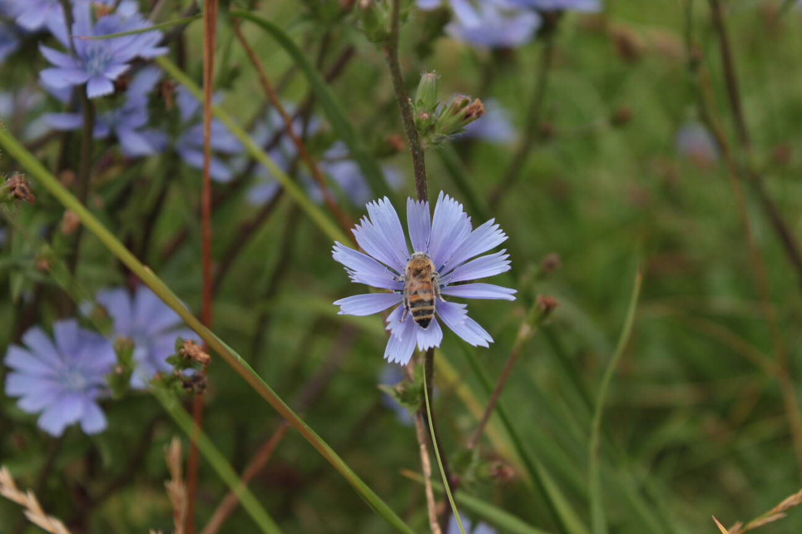

# Hello World

This is a test blog post. It does not tells anything usefull but it has a purpose.
It is providing and emxmapled markdown document for my static site generator.
I am targeting to create a simple static site generator that is going to support following features:

* Writing posts using markdown
* Adding images to posts
* Ability to post pages as previous and and next block post.

Yukarıda kendi çektiğim örnek bir resmi ekledim. Umarım sorunsuz görüntüleyebilirim.